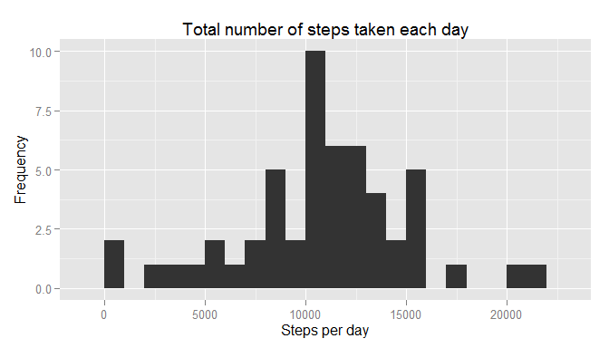
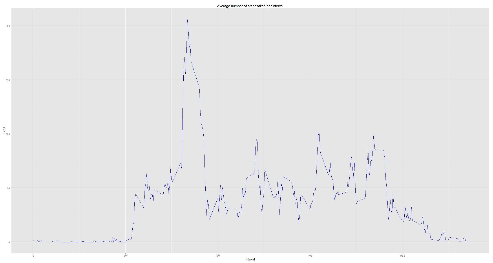
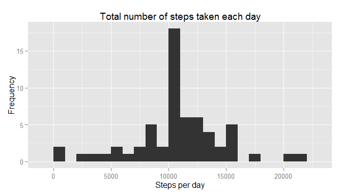
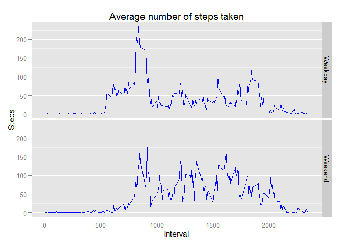

# Reproducible Research: Peer Assessment 1
## Introduction
This work is part of the Coursera Reproducible Research course. For more background
information view the `README.md` file in this repo.
It is assumed that the raw data files are available in the R working directory. 
The `ggplot2` library was used to create the figures in this research.

```r
library(ggplot2)
```

```
## Warning: package 'ggplot2' was built under R version 3.1.3
```

## Loading and preprocessing the data
Loading the activity.csv file into R.

```r
colClasses <- c("integer", "Date", "integer")
activity <- read.csv('activity.csv', colClasses = colClasses)
str(activity)
```

```
## 'data.frame':	17568 obs. of  3 variables:
##  $ steps   : int  NA NA NA NA NA NA NA NA NA NA ...
##  $ date    : Date, format: "2012-10-01" "2012-10-01" ...
##  $ interval: int  0 5 10 15 20 25 30 35 40 45 ...
```

Summing the total number of steps per day.

```r
activity_day <- aggregate(steps ~ date, data = activity, sum)
str(activity_day)
```

```
## 'data.frame':	53 obs. of  2 variables:
##  $ date : Date, format: "2012-10-02" "2012-10-03" ...
##  $ steps: int  126 11352 12116 13294 15420 11015 12811 9900 10304 17382 ...
```

Calculate the average number of steps per interval period

```r
activity_interval <- aggregate(steps ~ interval, data = activity, mean)
str(activity_interval)
```

```
## 'data.frame':	288 obs. of  2 variables:
##  $ interval: int  0 5 10 15 20 25 30 35 40 45 ...
##  $ steps   : num  1.717 0.3396 0.1321 0.1509 0.0755 ...
```

## What is mean total number of steps taken per day?
For this part of the assignment, we will ignore the missing values in the dataset.

Histogram of the total number of steps taken each day:

```r
qplot(steps, data=activity_day, geom = "histogram", binwidth = 1000) + 
      ggtitle("Total number of steps taken each day") + 
      xlab("Steps per day") + 
      ylab("Frequency")
```

 

Mean total number of steps taken:

```r
mean(activity_day$steps)
```

```
## [1] 10766.19
```
Median total number of steps taken:

```r
median(activity_day$steps)
```

```
## [1] 10765
```

## What is the average daily activity pattern?
Time series plot of the 5-minute interval versus the average number of steps taken:

```r
ggplot(activity_interval, aes(x = interval, y = steps)) +
      geom_line(colour = "blue") + 
      ggtitle("Average number of steps taken per interval") +
      xlab("Interval") +
      ylab("Steps")
```

 
The 5-minute interval that on average across all the days in the dataset, contains the
maximum number of steps:

```r
activity_interval[which.max(activity_interval$steps), ]
```

```
##     interval    steps
## 104      835 206.1698
```

## Imputing missing values
Note that there are a number of days/intervals where there are missing values 
(coded as  `NA`). The presence of missing days may introduce bias into some calculations
or summaries of the data.

The total number of rows with `NA` in this dataset:

```r
summary(activity)
```

```
##      steps             date               interval     
##  Min.   :  0.00   Min.   :2012-10-01   Min.   :   0.0  
##  1st Qu.:  0.00   1st Qu.:2012-10-16   1st Qu.: 588.8  
##  Median :  0.00   Median :2012-10-31   Median :1177.5  
##  Mean   : 37.38   Mean   :2012-10-31   Mean   :1177.5  
##  3rd Qu.: 12.00   3rd Qu.:2012-11-15   3rd Qu.:1766.2  
##  Max.   :806.00   Max.   :2012-11-30   Max.   :2355.0  
##  NA's   :2304
```
There are **2304** NAs in the steps column.

To remove these NAs we will replace them with the interval average that was calculated in
the previous section. First we merge the two data frames and then we remove the NAs.

```r
activity_noNA <- merge(activity, activity_interval, by = "interval")
activity_noNA <- transform(activity_noNA, 
                           steps = ifelse(is.na(steps.x), steps.y, steps.x))
activity_noNA <- activity_noNA[, c("interval", "date", "steps")]
str(activity_noNA)
```

```
## 'data.frame':	17568 obs. of  3 variables:
##  $ interval: int  0 0 0 0 0 0 0 0 0 0 ...
##  $ date    : Date, format: "2012-10-01" "2012-11-23" ...
##  $ steps   : num  1.72 0 0 0 0 ...
```

With the improved data let's check if there is an effect on the total number of steps
per day. First we recalculate the daily totals.

```r
activity_day_noNA <- aggregate(steps ~ date, data = activity_noNA, sum)
str(activity_day_noNA)
```

```
## 'data.frame':	61 obs. of  2 variables:
##  $ date : Date, format: "2012-10-01" "2012-10-02" ...
##  $ steps: num  10766 126 11352 12116 13294 ...
```
Histogram of the total number of steps taken each day:

```r
qplot(steps, data=activity_day_noNA, geom = "histogram", binwidth = 1000) + 
      ggtitle("Total number of steps taken each day") + 
      xlab("Steps per day") + 
      ylab("Frequency")
```

 

Mean total number of steps taken:

```r
mean(activity_day_noNA$steps)
```

```
## [1] 10766.19
```
Median total number of steps taken:

```r
median(activity_day_noNA$steps)
```

```
## [1] 10766.19
```
The estimated values did not have a significant difference on the mean and median. The
means are effecitvely identical; the median of the data set with estimated values was
slightly higher. From this data we can conclude that the NA replacement does not skew
the data. Using the 'improved' data set will not have a siginificant impact on the 
outcome of the analysis performed on the data.

## Are there differences in activity patterns between weekdays and weekends?
First we add a column that distinguishes between weekdays and weekend. And then we
calculate the average number of steps by interval period and time of the week.

```r
activity_wk <- transform(activity, weekday = ifelse(weekdays(as.Date(date)) %in% 
                           c("Saturday", "Sunday"), "Weekend", "Weekday"))
activity_wk <- aggregate(steps ~ interval + weekday, data = activity_wk, mean)
str(activity_wk)
```

```
## 'data.frame':	576 obs. of  3 variables:
##  $ interval: int  0 5 10 15 20 25 30 35 40 45 ...
##  $ weekday : Factor w/ 2 levels "Weekday","Weekend": 1 1 1 1 1 1 1 1 1 1 ...
##  $ steps   : num  2.333 0.462 0.179 0.205 0.103 ...
```

Comparison of the time series plots of the 5-minute interval versus the average number
of steps taken for weekdays and weekends:

```r
panel <- ggplot(activity_wk, aes(x = interval, y = steps)) +
      geom_line(colour = "blue")
panel + facet_grid(weekday ~ .) + 
      ggtitle("Average number of steps taken") +
      xlab("Interval") +
      ylab("Steps")
```

 
